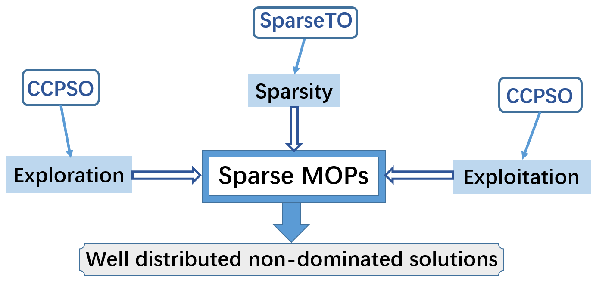

# ST-CCPSO
[Paper Link](https://www.sciencedirect.com/science/article/pii/S2210650222000530)

ST-CCPSO proposes a new perpective in solving ***sparse large-scale multi-objective*** optimization problems by introducing the gradient, which makes it achieve good performance effectively.

This code is from the paper 'A Cluster-Based Competitive Particle Swarm Optimizer with a Sparse Truncation Operator for Multi-Objective Optimization', published in 'Swarm and Evolutionary Computation'

## General framework

## Matlab Version
R2018

## Contact

Xiangyu Wang: [xiangyu.wang@uni-bielefeld.de](xiangyu.wang@uni-bielefeld.de) or [xiangyu_wang1216@163.com](xiangyu_wang1216@163.com)
-[Google Scholars](https://scholar.google.com.hk/citations?user=bWW6MRsAAAAJ&hl=zh-CN)
